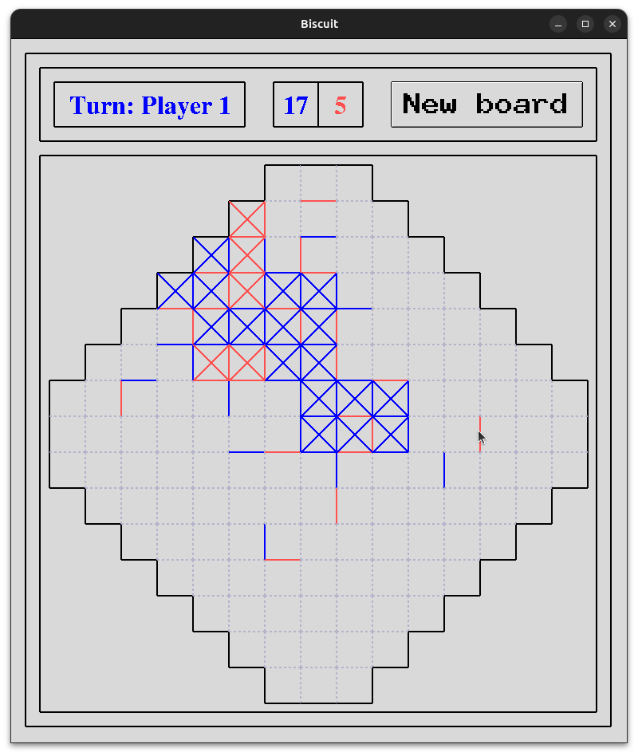
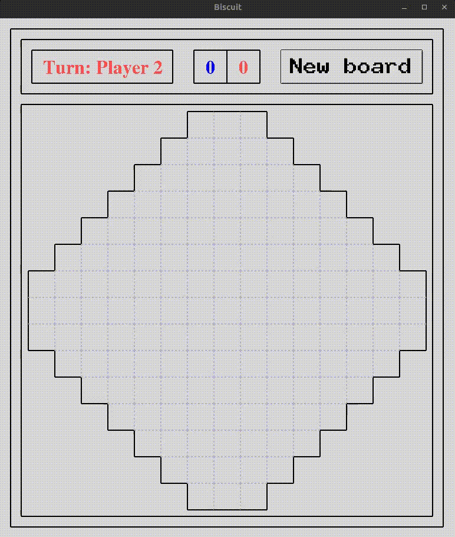

# boot-dev-pp-1 - "Biscuit"

https://www.boot.dev/learn/build-personal-project-1

https://tkdocs.com/tutorial/canvas.html

***

## How to play "Biscuit":

#### This games places greater emphasis on building and enclosing squares than on blocking the opponent.

### Drawing the diamond and inner squares: 

Draw a diamond on a piece of paper and divide it into small squares.

### Objective of the game: 

Players try to enclose a square by drawing the missing last side.

### Special rule: 

When a player encloses a square, the is entitled to make one additional move.

### Scoring: 

The player who encloses a square earns one point for each closed square and continues to play until there are no more open squares. The winner is the player with the highest number of closed squares.

### Strategies:

Blocking the opponent: Although the main goal is not to block the opponent, you can try to prevent them from opening key squares if possible.

### Planning moves: 

Think about future moves and try to anticipate and prevent the opponent from enclosing important squares.

***

## Dependencies

python 3.12.2 - https://www.python.org/downloads/ , https://wiki.python.org/moin/BeginnersGuide/Download

tkinter 8.6 - https://tkdocs.com/tutorial/install.html

***

## How to run it

1. Have the dependencies installed
2. In a terminal, access the *src* directory
3. Run either `python main.py` or `python3 main.py`
4. A window displaying the game should now be available on the screen
5. At random, *Player 1* or *Player 2* will have the first turn
6. The game has an auto-close cell feature for the special rule (see "How to play")

   
